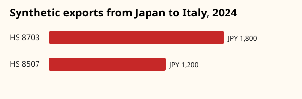

# Synthetic Italy–Japan trade case study

This example asks: **Which Japanese export categories to Italy grew most between two complete 12-month periods, and how did passenger-vehicle exports compare with peer markets?**

The compact scenario in `synthetic_scenario.csv` is explicitly synthetic and redistributable. It is expanded into monthly normalized records for January 2023–December 2024, then analyzed exclusively through JapanTrade’s public API.

From the repository root, reproduce every checked artifact with:

```bash
uv run python examples/italy-japan-trade/run_case_study.py
```

The command creates the expanded dataset, `italy_hs4_ranking.csv`, `hs8703_country_comparison.csv`, and the chart below.



## Findings

1. Italy’s synthetic HS 8507 exports doubled from JPY 600 to JPY 1,200, the fastest percentage growth among the two categories.
2. HS 8703 remained Italy’s largest category at JPY 1,800 in 2024, a 50% increase over 2023.
3. The United States led the selected 2024 HS 8703 markets at JPY 3,600; Germany declined from JPY 2,400 to JPY 2,160.

## Interpretation

Values are illustrative JPY amounts, not official observations or investment guidance. Both periods contain all 12 calendar months for every country. Real publications should cite the Japan Customs source release, preserve direction, and disclose missing coverage before interpreting growth.
